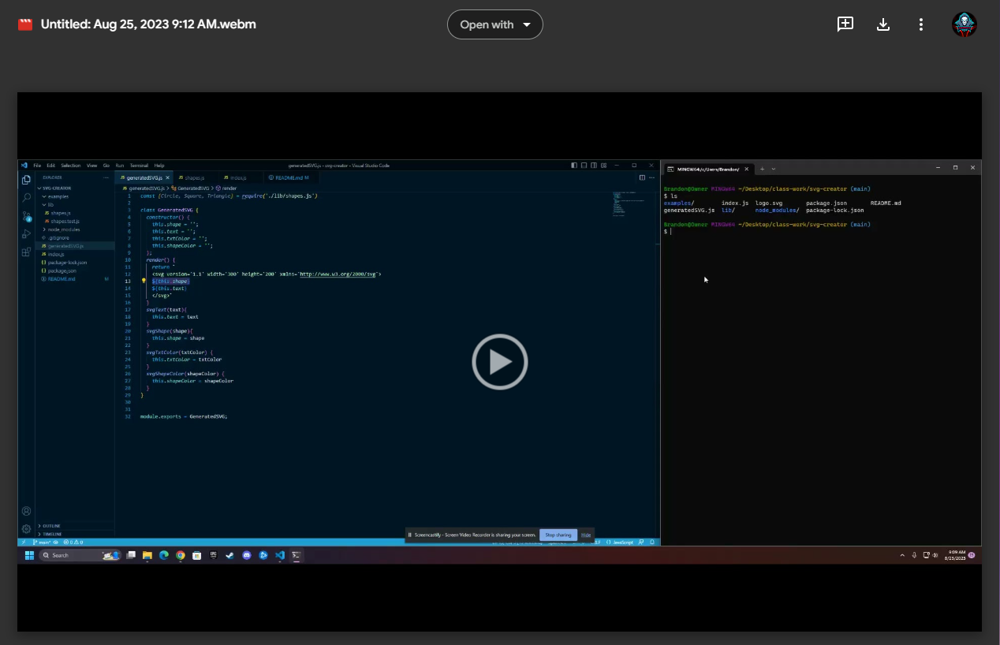
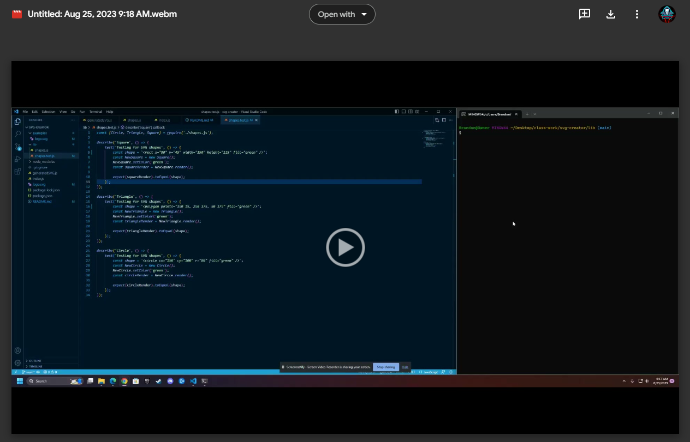

# SVG Generator

## For this assignment I was tasked with creating a SVG (Scalable Vector Graphic) Generator. Personally this has been one of the most challenging assignments for me with using module.exports and require(""). I received help from a tutor and a bunch of help from my TA Tye Stanley, without their help I would have been completely lost and nowhere close to where I am at now. The only issue I have left to fix is getting the text color to generate has the chosen text color.
# Links

## REPO: https://github.com/Bwilliams-88/svg-creator
## SVG Tutorial: https://drive.google.com/file/d/149MN6BTbo6Hpag5HQ-uRkbJLqkSI9y2b/view
## SVG Tests: https://drive.google.com/file/d/1p0uMyA2ShmHc15hfLBhbPkBdJl4qBASf/view

# Screenshots

## Tutorial Video:

## shapes.test.js Video:
